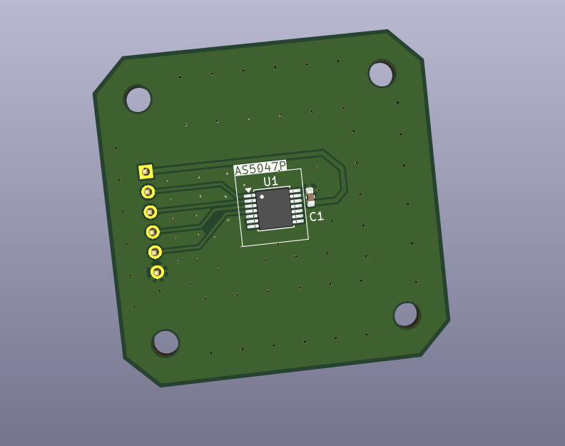
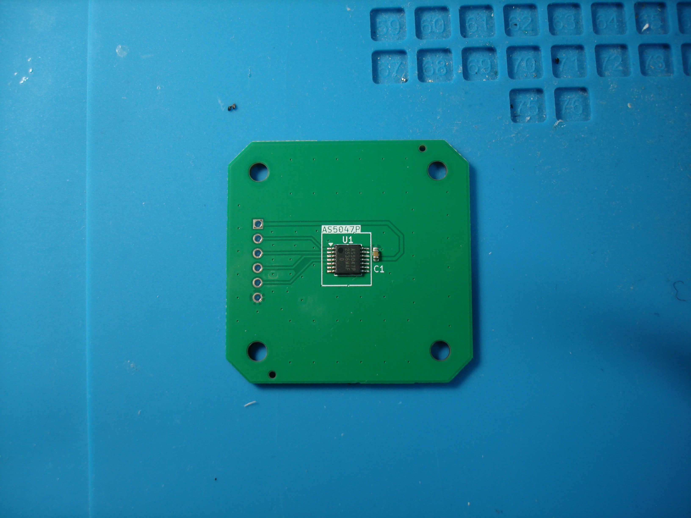
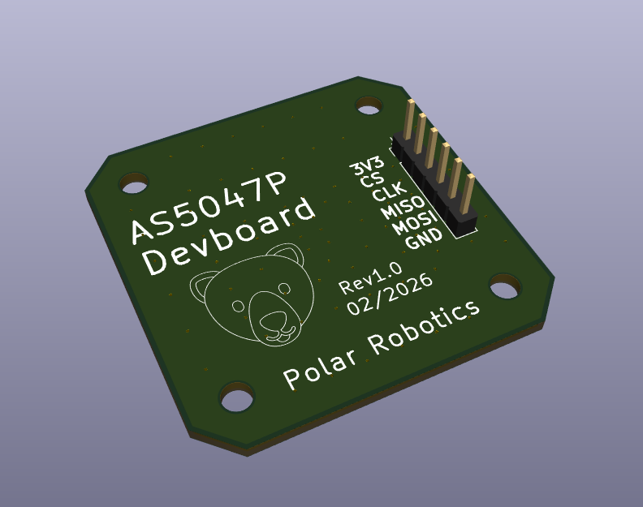
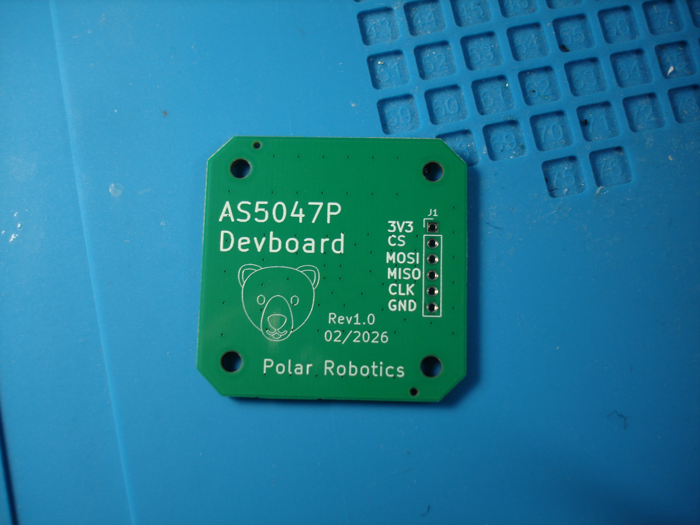
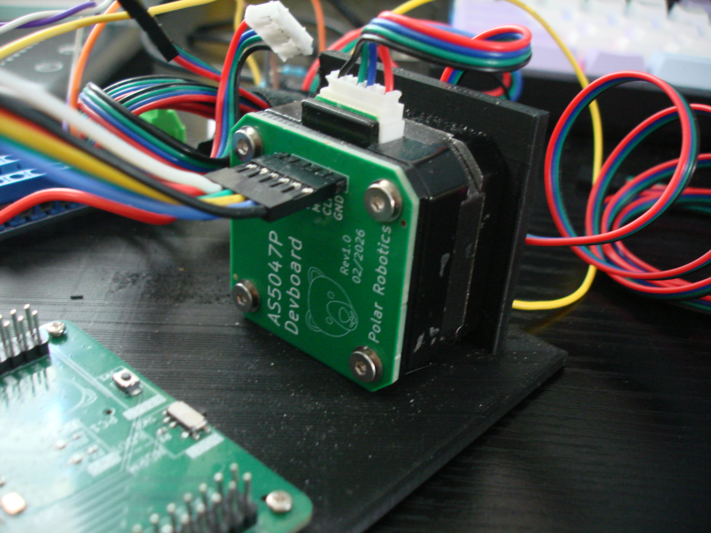
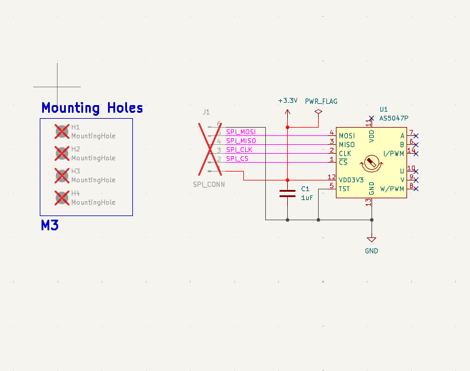
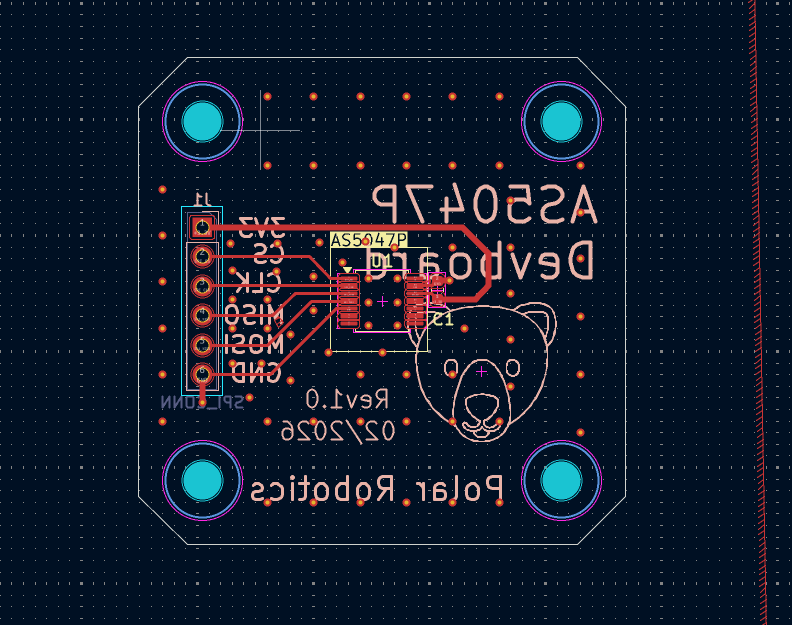

# AS5047P-Devboard
KiCAD project for breaking out the [AS5047P magnetic encoder](https://www.mouser.com/datasheet/2/588/AS5047P_DS000324_2-00-1843440.pdf?srsltid=AfmBOoqlObxHFXfx8f4ok6SL7VqrTWF4tzv9--7HmXC2F1Seg5sSNThs) onto a NEMA17 hole pattern

This only breaks out the SPI, since that is what my main purpose of it was. This is an incredibly simple PCB, and was ordered via JLCPCB

## Pictures

